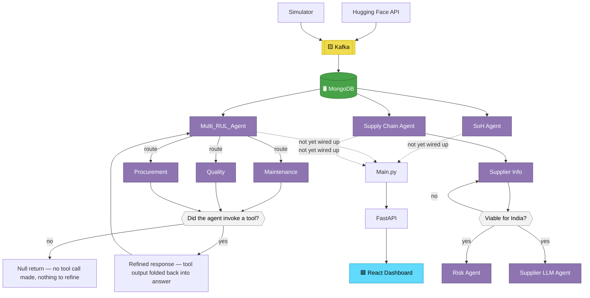

# ⚡ SkillCAD EV — Battery Supply Chain & Predictive Maintenance Platform

<div align="center">

**Multi-agent AI for EV battery health prediction + supply chain risk intelligence**

[]()
[]()
[]()
[]()
[]()
[]()
[]()

**Team:** SkillCAD EV — Arsh Srivastava ([arshsrivastava00@gmail.com](mailto:arshsrivastava00@gmail.com)) · [Repo](https://github.com/Arsh123344423/SkillCAD_EV_V1)

</div>

---

## 🎯 Problem

India's EV/battery supply chain relies on few upstream chokepoints, with low trust between users and manufacturers. This platform tackles both sides with two agent arms:

- 🔋 **Telemetry arm** — predicts battery **Remaining Useful Life (RUL)** from live sensor data and routes issues to the right specialist agent.
- 🌍 **Supply chain arm** — quantifies geopolitical/ESG risk over India's supply graph, with recommendations tied to **KABIL**, the **ACC PLI scheme**, and Quad/IPEF partnerships.

**Working hypothesis:** intent-routed multi-agent systems will beat a single general chatbot on accuracy and explainability. This has **not yet been benchmarked** — see [Validation Status](#-validation-status) below.

---

## 🏗 Architecture



**Legend:** 🟪 Purple = LLM agent · 🛢 Green = MongoDB · ◆ Grey diamond = decision · 🟨 Yellow = Kafka · 🟦 Blue = frontend
**Dashed arrow** = planned/in-progress connection, not yet implemented (see status table below).

### Diagram paths explained
- **Null return**: fires when a specialist agent (Maintenance / Quality / Procurement) determines no tool call is needed — the coordinator gets an empty result and moves on rather than looping.
- **Refined response**: fires when a specialist agent *does* invoke a tool — its output is folded back into `Multi_RUL_Agent`'s context so the next response reflects the tool result.

---

## 🤖 Agents at a Glance

| Subsystem | Key Agents | Status |
|---|---|:---:|
| **Supply Chain Risk** | Supply Chain Mgmt Agent, Supplier Info, Risk Factor LLM Agent, Supplier Info LLM Agent | ✅ Implemented |
| **Telemetry / RUL** | SoH Agent, Multi_RUL_Agent, Maintenance / Quality / Procurement Agents, Null Value return | ✅ Implemented |
| **Response Handling** | Orchestrate / Response Agent (`main.py` aggregation of SOH + RUL + SCM into a single FastAPI response) | 🟡 In Progress — not yet wired end-to-end |

> Note: the architecture diagram shows `Main.py` as the aggregation point for all three agent outputs. That connection is still being built (dashed arrow above) — today, each subsystem is queried independently via its own endpoint (see [API](#-api)).

---

## 📊 Validation Status

The core hypothesis (multi-agent routing > single chatbot) is not yet backed by measurements. Planned before calling this "validated":

| Metric | Method | Status |
|---|---|:---:|
| Routing accuracy | Manually labeled query set → compare Multi_RUL_Agent's routing decision vs. ground truth | ⬜ Not started |
| RUL prediction error | Compare against held-out battery cycling data (MAE / RMSE) | ⬜ Not started |
| Explainability | Side-by-side output comparison: single-agent vs. routed-agent response for the same query | ⬜ Not started |
| Latency | P50/P95 response time per endpoint | ⬜ Not started |

---

## 🛠 Tech Stack

| Layer | Tech |
|---|---|
| Streaming | Apache Kafka (Docker) |
| Database | MongoDB |
| RUL Agents | LangGraph + LangChain |
| Supply Chain Agents | Gemini-3.5-flash-lite (function calling) |
| Graph Modeling | NetworkX (DiGraph) |
| Backend | FastAPI |
| Frontend | React (Next.js) |

---

## 🔌 API

| Method | Path | Description |
|---|---|---|
| POST | `/agents/coordinator` | Query → Multi_RUL_Agent (routes to Maintenance/Quality/Procurement as needed) |
| POST | `/analyze/db` | Deterministic SoH / RUL calculation, no LLM routing |
| POST | `/supply-chain/agent` | Query → Supply Chain Agent |
| POST | `/supply-chain/analyze-node` | Risk breakdown per supplier |
| GET | `/supply-chain/nodes` | Graph data for frontend |

---

## 🚀 Getting Started

### Prerequisites
- Python 3.10+
- Node.js 18+
- Docker (for Kafka)
- MongoDB instance (local or Atlas)
- A Gemini API key

### 1. Start Kafka (Docker)
```bash
docker-compose up -d kafka zookeeper
```

### 2. Configure environment
Create a `.env` file in `backend/`:
```bash
GEMINI_API_KEY=your_key_here
MONGO_URI=mongodb://localhost:27017
KAFKA_BROKER=localhost:9092
```

### 3. Backend
```bash
cd backend
pip install -r requirements.txt
uvicorn main:app --host 0.0.0.0 --port 8000
```

### 4. Frontend
```bash
cd frontend
npm install
npm run dev
```

Frontend expects the backend at `http://localhost:8000` by default — update `frontend/.env.local` if you're running it elsewhere.

---

## ⚠️ Known Limitations

- No real-time live data ingestion (currently simulator + Hugging Face dataset replay)
- No login-based RAG / per-user personalization
- No raw-material shipment tracking
- No cross-subsystem LLM communication (SoH, RUL, and Supply Chain agents don't share context)
- No TTL on MongoDB records
- Orchestration layer (`main.py` → unified FastAPI response) not yet complete — see [Validation Status](#-validation-status)

---

## 📄 License

MIT — see `LICENSE` for details.

## 🤝 Contributing

Issues and PRs welcome. For larger changes, please open an issue first to discuss scope.

---

<div align="center">Made with ⚡ by Team SkillCAD EV</div>
