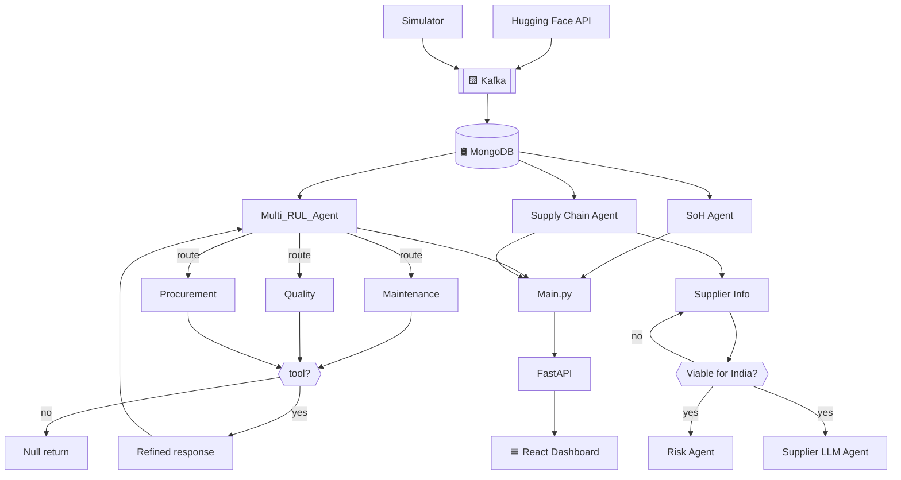

# ⚡ SkillCAD EV — Battery Supply Chain & Predictive Maintenance Platform

<div align="center">

**Multi-agent AI for EV battery health prediction + supply chain risk intelligence**

[]()
[]()
[]()
[]()
[]()
[]()

**Team:** SkillCAD EV — Arsh Srivastava ([arshsrivastava00@gmail.com](mailto:arshsrivastava00@gmail.com)) · [Repo](https://github.com/Arsh123344423/SkillCAD_EV_V1)

</div>

---

## 🎯 Problem

India's EV/battery supply chain relies on few upstream chokepoints, with low trust between users and manufacturers. This platform tackles both sides with two agent arms:

- 🔋 **Telemetry arm** — predicts battery **Remaining Useful Life (RUL)** from live sensor data and routes issues to the right specialist agent.
- 🌍 **Supply chain arm** — quantifies geopolitical/ESG risk over India's supply graph, with recommendations tied to **KABIL**, the **ACC PLI scheme**, and Quad/IPEF partnerships.

**Hypothesis:** intent-routed multi-agent systems beat a single general chatbot on accuracy and explainability.

---

## 🏗 Architecture



**Legend:** 🟪 Purple = LLM agent · 🛢 = MongoDB · ◆ = decision · 🟨 = Kafka · 🟦 = frontend

---

## 🤖 Agents at a Glance

| Subsystem | Key Agents | Status |
|---|---|:---:|
| **Supply Chain Risk** | Supply Chain Mgmt Agent, Supplier Info, Risk Factor LLM Agent, Supplier Info LLM Agent | ✅ Implemented |
| **Telemetry / RUL** | SoH Agent, Multi_RUL_Agent, Maintenance / Quality / Procurement Agents, Null Value return | ✅ Implemented |
| **Response Handling** | Orchestrate / Response Agent | 🟡 In Progress |

---

## 🛠 Tech Stack

| Layer | Tech |
|---|---|
| Streaming | Apache Kafka (Docker) |
| Database | MongoDB |
| RUL Agents | LangGraph + LangChain |
| Supply Chain Agents | Gemini-3.5-flash-lite (function calling) |
| Graph Modeling | NetworkX (DiGraph) |
| Backend | FastAPI |
| Frontend | React (Next.js) |

---

## 🔌 API

| Method | Path | Description |
|---|---|---|
| POST | `/agents/coordinator` | Query → Multi_RUL_Agent |
| POST | `/analyze/db` | Deterministic SoH / RUL |
| POST | `/supply-chain/agent` | Query → Supply Chain Agent |
| POST | `/supply-chain/analyze-node` | Risk breakdown per supplier |
| GET | `/supply-chain/nodes` | Graph data for frontend |

---

## 🚀 Getting Started

**Backend**
```bash
cd backend
pip install -r requirements.txt
uvicorn main:app --host 0.0.0.0 --port 8000
```

**Frontend**
```bash
cd frontend
npm install
npm run dev
```

---

## ⚠️ Limitations

No real-time live data · no login-based RAG · no raw-material shipment tracking · no cross-subsystem LLM communication · no TTL on records.

---

<div align="center">Made with ⚡ by Team SkillCAD EV</div>
